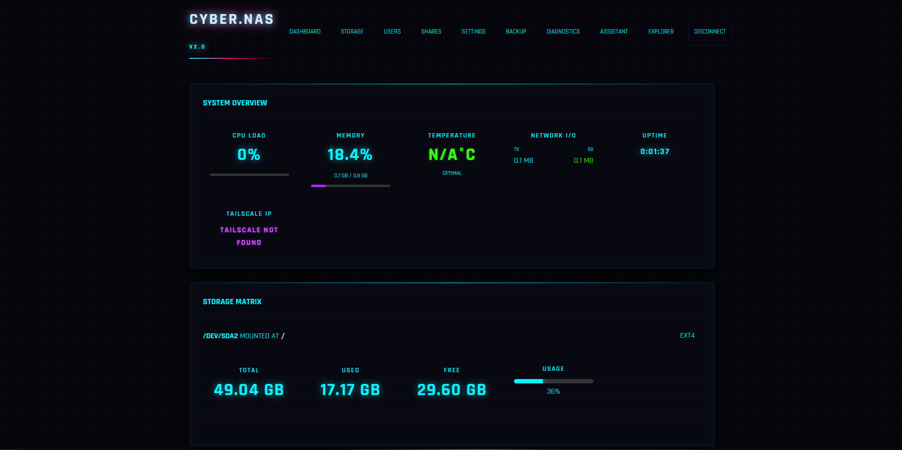
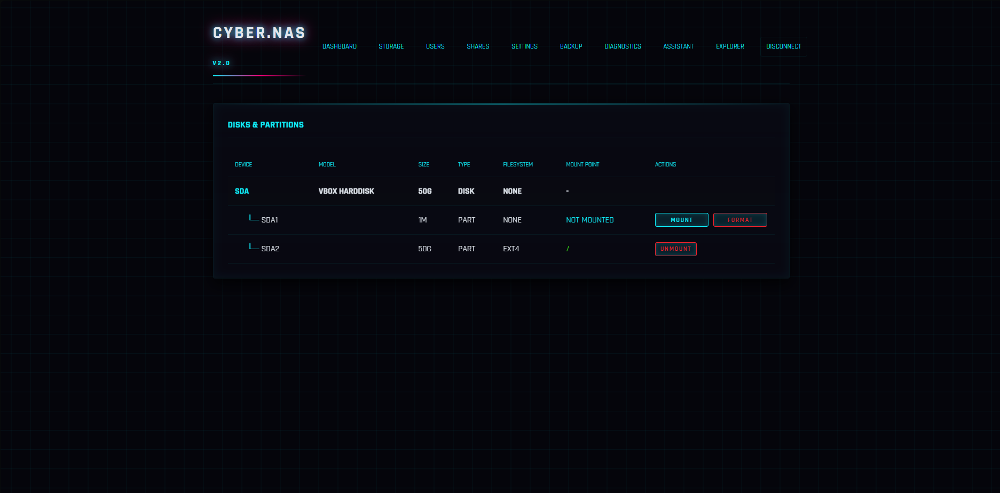
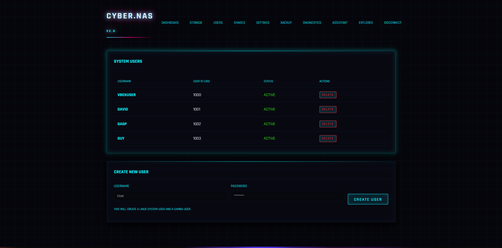
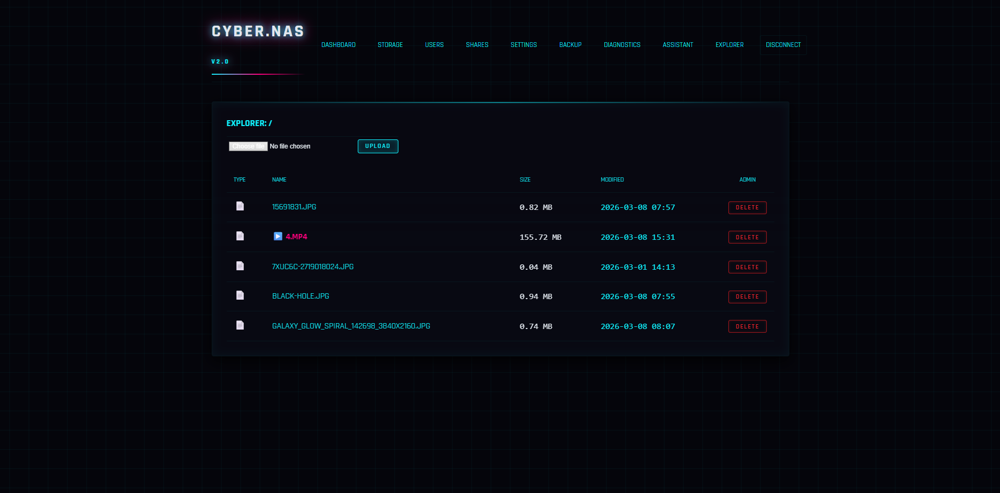
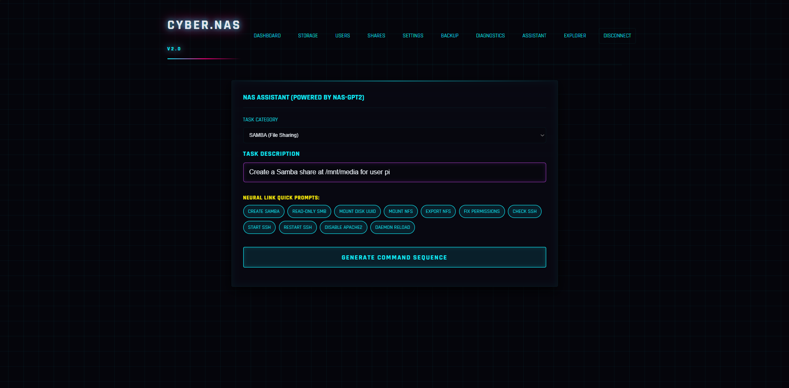
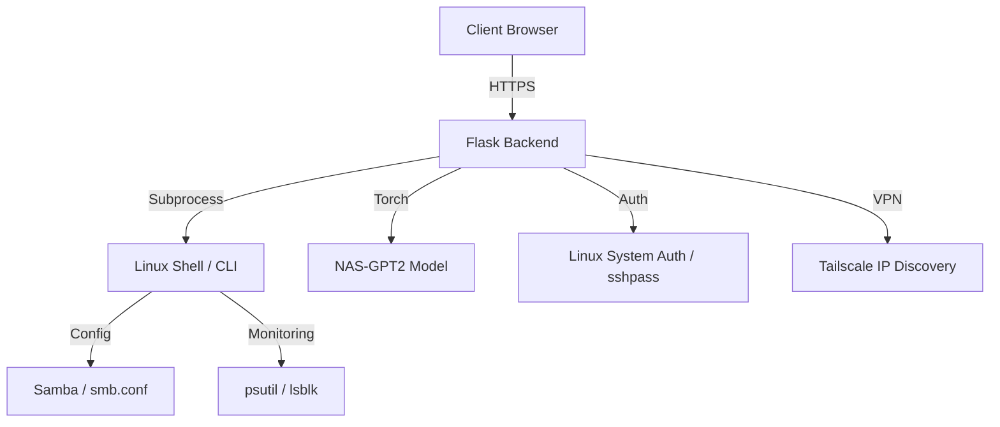

# Smol NAS AI 🧾🤖

### Autonomous AI-Powered NAS Management Platform

<div align="center">


**Project Goal:** Simplify server administration through a natural language interface and a streamlined web UI.

</div>

---

## 📖 What is Smol NAS AI?

Smol NAS AI is an **intelligent storage management platform** that transforms complex server administration into intuitive interactions. By combining a **custom-tuned GPT-2 model** with a robust Flask-based backend, Smol allows users to manage Samba shares, RAID arrays, and user permissions using natural language instructions.

Traditional NAS management requires deep CLI knowledge. Smol bridge this gap by providing:
1. **AI Command Generation**: A 250M parameter GPT-2 model trained specifically for NAS CLI commands.
2. **Real-time System Monitoring**: Live tracking of CPU, RAM, Temperature (optimized for Raspberry Pi), and Network I/O.
3. **Autonomous Share Management**: One-click Samba configuration and user delegation.

---

## 🖼️ Application Screenshots

### 🖥️ Main Dashboard

<div align="center">
  
  <br/><sub>Centralized monitoring of system health, network traffic, and active Samba sessions.</sub>
</div>

---

## 📁 Management Modules

<table>
  <tr>
    <td align="center" width="50%">
      
      <br/><b>Storage & RAID</b>
      <br/><sub>Visual disk management: mount/unmount, format, and RAID status tracking via `lsblk`.</sub>
    </td>
    <td align="center" width="50%">
      
      <br/><b>User Controls</b>
      <br/><sub>Manage Linux and Samba users. Integration with `chpasswd` and `smbpasswd`.</sub>
    </td>
  </tr>
  <tr>
    <td align="center" width="50%">
      
      <br/><b>File Manager</b>
      <br/><sub>Web-based file management with integrated permission controls.</sub>
    </td>
    <td align="center" width="50%">
      
      <br/><b>AI Assistant</b>
      <br/><sub>Instruction-based command generation. Ask "Create a Samba share" and get the CLI command instantly.</sub>
    </td>
  </tr>
</table>

---

## 🏗️ System Architecture



---

## 🧠 AI Pipeline Deep-Dive

### Custom NAS-GPT2 Model
The heart of Smol is a specialized GPT-2 model fine-tuned on a high-quality dataset of NAS administrative tasks.

```python
# Inference Logic (test.py)
inputs = tokenizer(prompt, return_tensors="pt").to(device)
outputs = model.generate(
    **inputs,
    max_new_tokens=150,
    temperature=0.2,
    top_p=0.85,
    repetition_penalty=1.1
)
```

### Command Categories
The model supports structured instructions across multiple domains:
- `[SAMBA]`: Share creation, user access, and global settings.
- `[RAID]`: Array creation, disk addition, and status checks.
- `[NFS]`: Export management and mount configurations.
- `[PERMISSION]`: `chown` and `chmod` generation.
- `[SERVICE]`: Systemd service control and server reboots.

---

## 🛠️ Full Technology Stack

| Layer | Technology | Why |
|---|---|---|
| Backend Framework | Flask | Lightweight, extensible, perfect for embedded systems |
| AI / LLM | GPT-2 (250M) | Local execution, no internet required for core AI |
| Machine Learning | PyTorch + Transformers | Industry standard for NLP tasks |
| System Monitoring | psutil | Cross-platform system metrics extraction |
| Storage Interface | lsblk + mkfs | Direct interaction with Linux block devices |
| Authentication | Flask-Login + sshpass | Secure session management with system integration |
| Networking | Tailscale | Easy remote access without port forwarding |
| Frontend | Jinja2 Templates + HTML/CSS | Minimal overhead for server-side rendering |

---

## 🚀 Local Development Setup

### Prerequisites
- Python 3.10+
- Git LFS (for model weights)
- Linux environment (recommended for full system feature support)

### Installation

1. **Clone and Setup**:
   ```bash
   git clone https://github.com/Vector3451/Smol.git
   cd Smol
   pip install -r requirements.txt
   ```

2. **Pull Model Weights**:
   ```bash
   git lfs pull
   ```

3. **Configure Environment**:
   Create a `.env` or set environment variables:
   ```env
   SECRET_KEY=your_secret_key
   NAS_USER=admin
   NAS_PASSWORD=your_password
   NAS_ENV=production  # Use 'development' for mock system calls
   ```

4. **Run the Application**:
   ```bash
   cd NAS
   python app.py
   ```
   Access the UI at `http://localhost:5000`.

---

## 📁 Project Structure

```
Smol/
├── assets/screenshots/    # README visual documentation
├── nas_model_250m/        # Full PyTorch model weights (LFS)
├── nas_model_q8.gguf      # Quantized model for efficient inference
├── tokenizer/             # Custom tokenizer configurations
├── NAS/                   # Core Application Logic
│   ├── app.py             # Flask Entrypoint & Route Handlers
│   ├── diagnostic.py      # System Readiness Checker
│   ├── servicenow.py      # Integration for incident reporting
│   └── templates/         # UI View Templates
├── test.py                # Standalone Inference Script
└── README.md              # This file
```

---

## 🤝 Authors
Built for modern storage management.
For questions, contact the repository owner.
